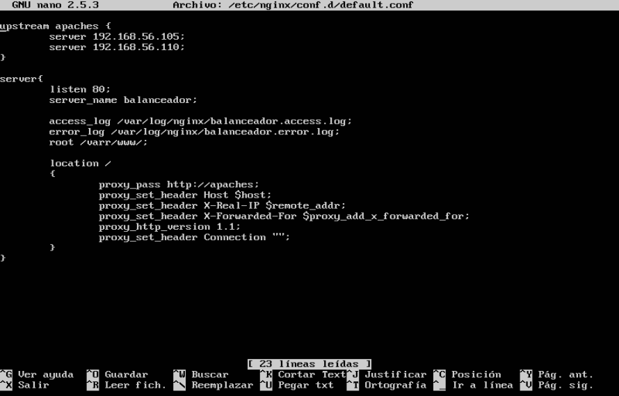
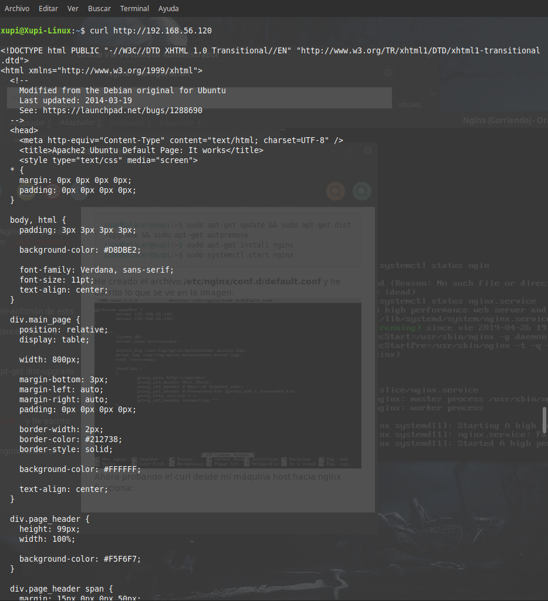
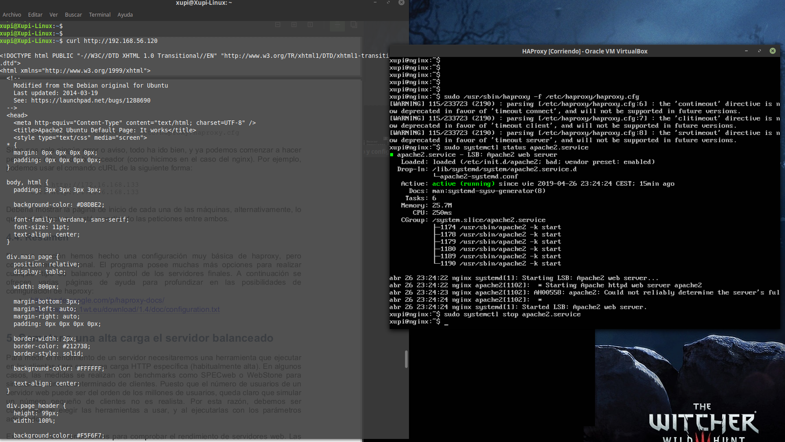
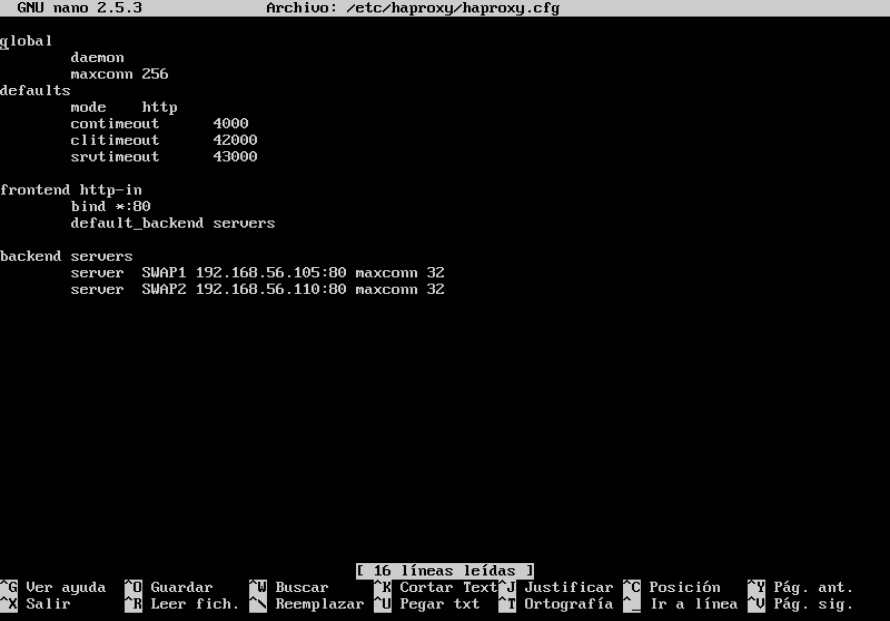
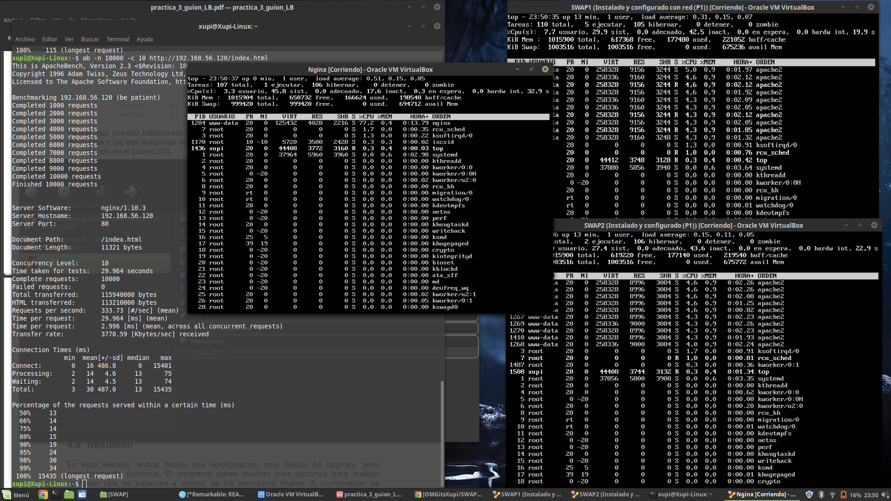
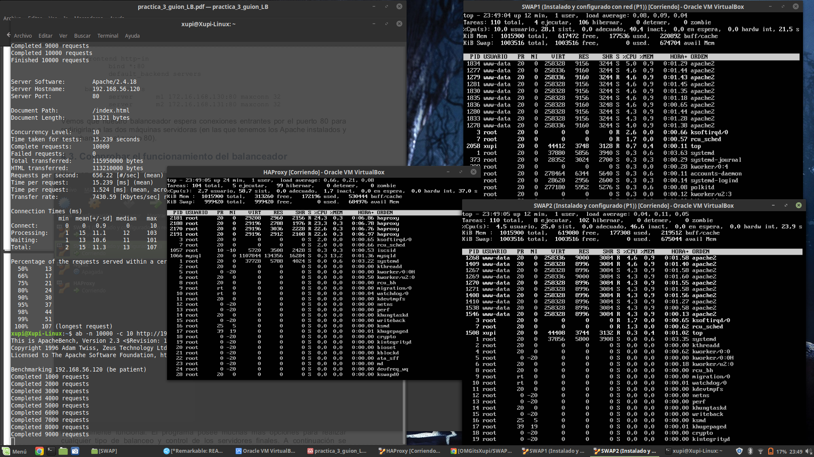

# Prácticas 1 y 2 - SWAP
### Por: Antonio Galdó Seiquer
Inicialmente he creado otra máquina virtual llamada Nginx con Ubuntu Server 16 igual que las otras. He modificado el archivo __/etc/network/interfaces__ añadiendo lo siguiente:
```
auto enp0s8
iface enp0s8 inet static
address 192.168.56.120
```
Después he añadido el adaptador de red con la red solo-anfitrión de esta máquina en VirtualBox.
Acto seguido la he apagado y la he clonado a LoadBalancer2. En la 1 instalaré __nginx__ y en la 2, __haproxy__.
#### En Nginx:
```concole
LoadBalacer@xupi:~$ sudo apt-get update && sudo apt-get dist-upgrade && sudo apt-get autoremove
LoadBalacer@xupi:~$ sudo apt-get install nginx
LoadBalacer@xupi:~$ sudo systemctl start nginx
```
He creado el archivo __/etc/nginx/conf.d/default.conf__ y he escrito lo que se ve en la imagen: 
 
Ahora probando el curl desde mi máquina host hacia nginx funciona:


#### En HAProxy:
He instalado correctamente HAProxy y cambiado el archivo de configuración para que detecte ambas máquinas y vemos cómo no tiene el apache funcionando y nos redirige a una de las máquinas haciendo curl:


Aquí podemos ver el archivo __/etc/haproxy/haproxy.cfg__


TEST
En estas capturas veremos el resultado de ejecutar _top_ en todas las máquinas y con la siguiente orden (desde la máquina host) hacer muchas peticiones (10000) al balanceador.
```concole
xupi@xupi-Linux:~$ ab -n 10000 -c 10 http://192.168.56.120/index.html
```
Nginx:

HAProxy:


