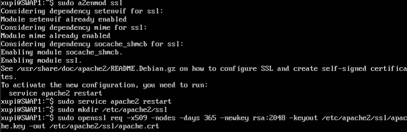
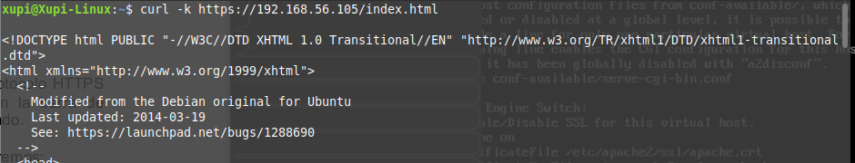
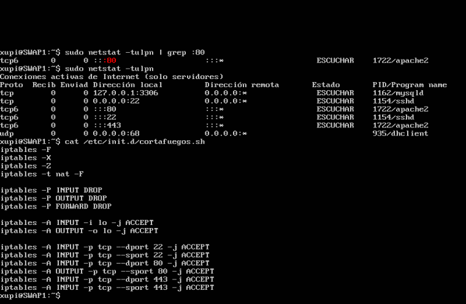

# Práctica 3 - SWAP
### Por: Antonio Galdó Seiquer
He creado un certificado autofirmado que nos sirve para nuestra granja web, y he configurado el cortafuegos para que una de las máquinas esté protegida pero permita el acceso por __ssh__ y por __http__ y __https__.
### Crear certificado para HTTPS
Con estos pasos se puede generar con apache un certificado autofirmado sin ninguna dificultad (he hecho esto en un aúnica máquina):
```console
xupi@SWAP:~$ a2enmod ssl
xupi@SWAP:~$ service apache2 restart
xupi@SWAP:~$ mkdir /etc/apache2/ssl
xupi@SWAP:~$ openssl req -x509 -nodes -days 365 -newkey rsa:2048 -keyout /etc/apache2/ssl/apache.key -out /etc/apache2/ssl/apache.crt
```
 

Acto seguido he editado __/etc/apache2/sites-available/default-ssl.conf__ y añadir lo siguiente debajo de donde pone _SSLEngine_:
```
SSLCertificateFile /etc/apache2/ssl/apache.crt
SSLCertificateKeyFile /etc/apache2/ssl/apache.key
```
Tras esto he activado la configuración y recargado el servicio:
```
a2ensite default-ssl
service apache2 reload
```
Ya podemos conectarnos al servidor por un navegador o con curl, aunque en Chrome vemos que nos da un aviso porque es un certificado autofirmado, sin verdadera validez.
 

Aquí vemos cómo funciona una conexión con https mediante _curl_
 

Ahora con rsync he copiado los archivos _apache.crt_ y _apache.key_ a la segunda máquina y al balanceador Nginx con rsync. En la segunda máquina los he movido a __etc/apache2/ssl__ y he modificado el archivo de configuración y activado el sitio ssl igual que en la primera máquina.
En el balanceador he modificado __/etc/nginx/conf.d/default.conf__ añadiendo lo siguiente, y he reiniciado _Nginx_.
```
listen 443 ssl;
ssl on;
ssl_certificate /tmp/apache.crt;
ssl_certificate_key /tmp/apache.key;
```
### Configurar cortafuegos
En la máquina SWAP1 he creado un cript __cortafuegos.sh__ en __etc/init.d/__ y lo he configurado para que se pueda ejecutar. He añadido las reglas que se ven en la imagen para resetear la configuración, denegar cualquier tráfico por defecto y después permitir los puertos 22, 80 y 443 para SSH, HTTP y HTTPS, respectivamente. 
Después con `netstat -tulpn` podemos ver los puertos abiertos.
 


