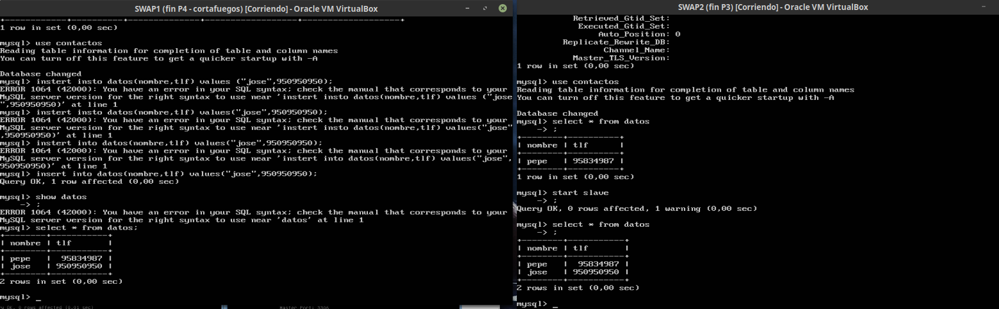

# Práctica 5 - SWAP
### Por: Antonio Galdó Seiquer
### Replicar datos de una máquina a otra
Primero, he creado en ambas máquinas (SWAP1 y SWAP2), una base de datos llamada __contactos__ con una tabla llamada __datos__, pero sólo he creado la tabla en la BD de la máquina SWAP1.
 
Con mysqldump podemos hacer un _backup_ de los datos de la BD, pero antes hay que bloquear los datos primero:
```
xupi@SWAP:~$ mysql -u root –p

mysql> FLUSH TABLES WITH READ LOCK;
mysql> quit
```
He hecho el _backup_ en SWAP1 con la siguiente orden:
```
mysqldump contactos -u root -p > /tmp/contactos.sql
```
Y las desbloqueamos así:
```
xupi@SWAP:~$ mysql -u root –p

mysql> UNLOCK TABLES;
mysql> quit
```
 
En la máquina SWAP2 he hecho lo siguiente para copiar el _backup_ de una máquina a otra y restaurar los datos (la tabla __datos__ se crea automáticamente:
```
xupi@SWAP:~$ scp maquina1:/tmp/ejemplodb.sql /tmp/
xupi@SWAP:~$ mysql -u root -p contactos < /tmp/contactos.sql
```
 
 
### Replicar la _BD_ mediante la configuración _maestro/esclavo_ 
El maestro es la máquina __SWAP1__. He tenido que modificar el archivo _/etc/mysql/mysql.conf.d/mysqld.cnf_ de la siguiente manera:
- bind-address 127.0.0.1 -> #bind-address 127.0.0.1
- #server-id = 1 -> server-id = 1
- #log_bin	= /var/log/mysql/mysql-bin.log -> log_bin	= /var/log/mysql/bin.log
Y con `/etc/init.d/mysql restart` reiniciamos el servicio (debe poner _ok_).

Como mi versión de mysql es 5.5 o superior, en la máquina esclavo (__SWAP2__) habrá que hacer los mismos pasos, excepto que _server-id = 1_ será _server-id = 2_.
Ahora en la máquina __SWAP1__ entré en mysql y puse lo siguiente para crear el usuario _esclavo_:
```
mysql> CREATE USER esclavo IDENTIFIED BY 'esclavo';
mysql> GRANT REPLICATION SLAVE ON *.* TO 'esclavo'@'%' IDENTIFIED BY 'esclavo';
mysql> FLUSH PRIVILEGES;
mysql> FLUSH TABLES;
mysql> FLUSH TABLES WITH READ LOCK;
```
Y con `mysql> SHOW MASTER STATUS;` veremos los datos necesarios para enlazar el esclavo con el maestro como se ve en la imagen:

En __SWAP2__, en mysql he puesto lo siguiente para enlazarlos y empezar el esclavo:
```
mysql> CHANGE MASTER TO MASTER_HOST='192.168.56.105', MASTER_USER='esclavo', MASTER_PASSWORD='esclavo', MASTER_LOG_FILE='bin.000001', MASTER_LOG_POS=980, MASTER_PORT=3306;
mysql> START SLAVE;
```

En __SWAP1__ he hecho `mysql> UNLOCK TABLES;` para poder modificar los datos y después en __SWAP2__, `mysql> SHOW SLAVE STATUS\G` para comprobar que todo va bien:
(terminal de la máquina host con ssh para ampliar el mensaje en la terminal):

Podemos comprobar que todo va bien porque la variable _Seconds_Behind_Master_ vale 0, o _Master_Server_Id_ debe valer 1 (yo por esto me di cuenta de que tenía un fallo y tuve que repetir el último paso).
Si está bien configurado, podremos modificar o insertar datos en __SWAP1__ (el maestro) y se replicará en __SWAP2__ (el esclavo).
