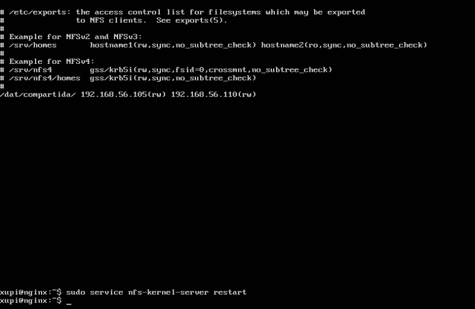
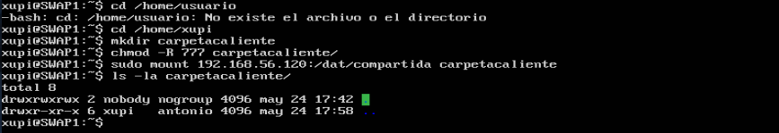

# Práctica 6 - SWAP
### Por: Antonio Galdó Seiquer
### Servidor de disco NFS
En la máquina llamada Nginx, he instalado el servidor de NFS de la siguiente manera:
```
xupi@SWAP:~$ sudo apt-get install nfs-kernel-server nfs-common rpcbind
xupi@nginx:~$ mkdir /dat
xupi@nginx:~$ mkdir /dat/compartida
xupi@nginx:~$ sudo chown nobody:nogroup /dat/compartida/
xupi@nginx:~$ sudo chmod -R 777 /dat/compartida/
```
A continuación he modificado el archivo __/etc/exports/__ añadiendo lo siguiente (las ips de las otras dos máquinas):



Y he reiniciado el servicio con `sudo service nfs-kernel-server restart`.

### Configurar los clientes
En las dos máquinas clientes he hecho lo siguiente para que se coordinen con el servidor en el directorio __carpetacaliente__:
```
xupi@SWAP:~$ sudo apt-get install nfs-common rpcbind
xupi@SWAP:~$ cd /home/xupi
xupi@SWAP:~$ mkdir carpetacliente
xupi@SWAP:~$ sudo chmod -R 777 carpetacaliente
xupi@SWAP:~$ sudo mount 10.10.10.13:/dat/compartida carpetacliente
```
Y ya podemos ver que se ha sincronizado:



Para que se monte el directorio automáticamente al iniciar las máquinas clientes (SWAP1 y SWAP2) he añadido esto al archivo __/etc/fstab/__:
```
10.10.10.13:/dat/compartida /home/usuario/carpetacliente/ nfs auto,noatime,nolock,bg,nfsvers=3,intr,tcp,actimeo=1800 0 0
```


Y ya podemos reiniciar el sistema y las carpetas seguirán sicronizadas con la der servidor.
Estos últimos pasos los he hecho exactamente iguales en cada una de las 2 máquinas clientes.