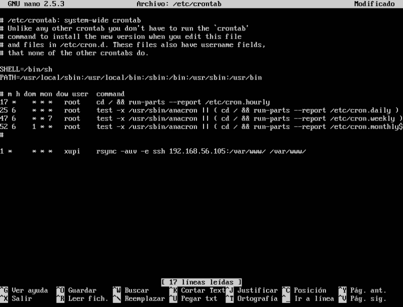

#Prácticas 1 y 2 - SWAP
###Por: Antonio Galdó Seiquer
Teniendo ya las máquinas instaladas, con el LAMP configurado y la configuración de interfaz de red para que se conectaran las máquinas entre sí y con el host, he realizado los siguientes pasos para tener una copia del servidor web en una de las máquinas de la otra.
Como ya tenemos 'rsync' instalado por defecto no hará falta instalarlo.

Lo primero que he hecho es este comando para que nuestro usuario (en este caso _xupi_) tenga permisos para interactuar con el directorio del servidor Apache:
```console
xupi@SWAP2:~$ sudo chown xupi –R /var/www
```
Tras esto he configurado el acceso a la máquina 1 con ssh sin contraseña:
```console
xupi@SWAP2:~$ ssh-keygen -b 4096 -t rsa
```
He dejado los valores por defecto para que se generen las llaves en ~/.ssh/ y no haga falta contraseña.
A continuación he pasado la clave a la máquina 1 y con esto ya no haría falta contraseña para ssh:
```console
xupi@SWAP2:~$ ssh-copy-id 192.168.56.105
```
A continuación he configurado el crontab para que ejecute rsync cada 1 minuto con:
```console
xupi@SWAP2:~$ sudo nano /etc/crontab
```
He añadido la orden rsync `rsync -auv -e ssh 192.168.56.105:/var/www/ /var/www` y el archivo queda así:

