# Trabajo Final - SWAP
# Balanceador de Carga sobre AWS
## Crear instancia
Vamos a hacer un balanceador de carga para múltiples servidores web sobre Amazon Web Service. Lo primero que haremos será registrarnos y seleccionar el plan gratuito (o bien la prueba gratis de 12 meses).
Una vez hecho esto iniciaremos sesión y seremos redirigidos a la consola de AWS:
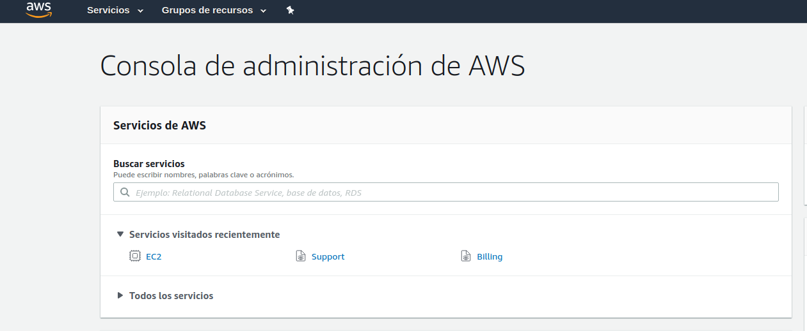

En la búsqueda de servicios buscaremos `EC2`, que será nuestro espacio de trabajo.
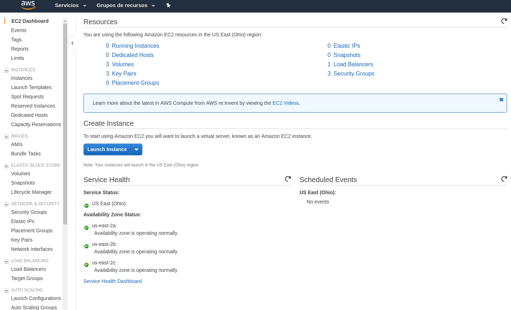

En la esquina superior derecha de la web podemos cambiar la ubicación del servidor donde se crearán nuestras instancias, pero yo lo dejaré en _Ohio_.

Haremos click en el botón de `Launch Instance` y tendremos una serie de opciones entre los SO disponibles. Yo elegiré _Ubuntu Server_, aunque el balanceador de carga sirve para cualquier sistema con servidor web.
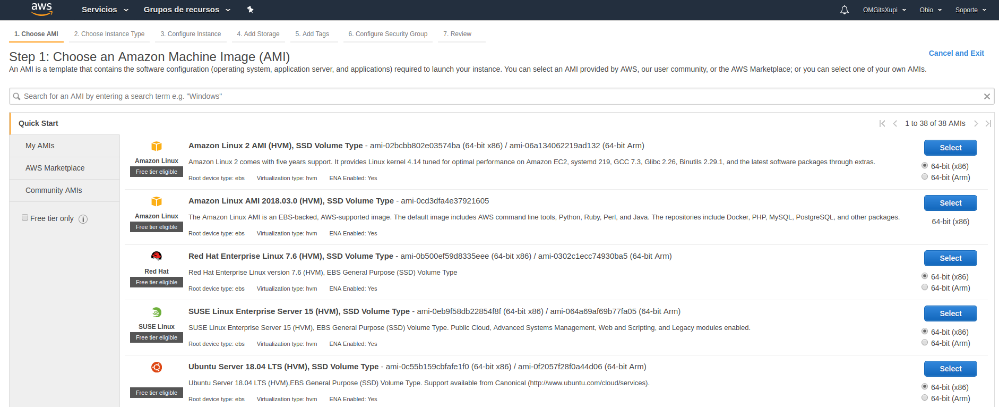

En las siguientes pantallas dejaremos las opciones por defecto hasta llegar al Security Group. Añadiremos dos reglas para _http_ y _https_.
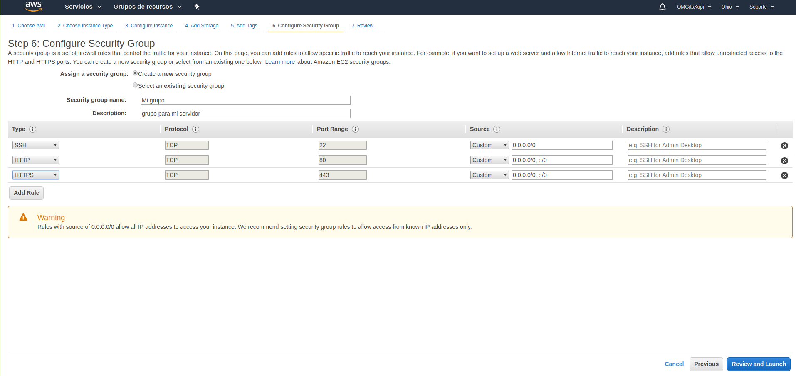

 Como dice en el Warning, podemos cambiar la ip fuente en ssh a la nuestra para que solo podamos acceder nosotros, pero podemos dejarlo así.
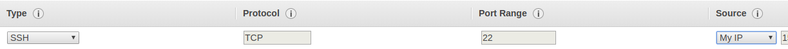

Iremos a _Review_ y pulsaremos `Launch`.
Nos saldrá una ventana para las claves de ssh. La llamamos como queramos y guardaremos la clave privada bien porque nos servirá para acceder a nuestra máquina.
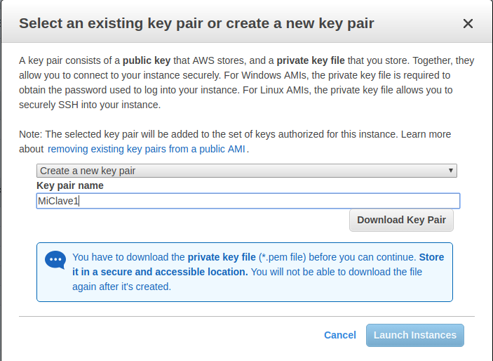

Ya tenemos una máquina operativa con Ubuntu Server.
Ahora repetiremos los pasos para crear otra máquina igual, pero en el _Security Group_ seleccionaremos el que creamos previamente. Tendremos que crear otro par de claves y guardar su clave privada.
Seremos redirigidos  a el menú de Instancias donde podremos ver su ip, pararlas, cambiarles el grupo de seguridad y más opciones.
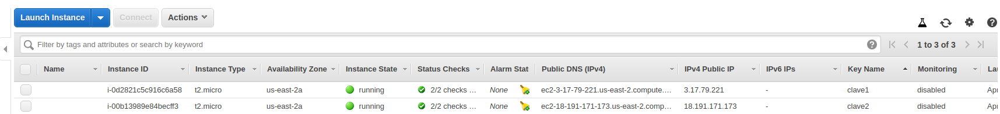

__Aviso:__ El límite del plan gratuito en AWS son 750 horas de uso de instancia al mes, así que si usas una no pasa nada, pero al usar más de una instancia, hay que apagarlas para no superar el límite.

## Conectarse a Instancia por SSH
Si hacemos click en `Connect` podremos ver los pasos que tendríamos que hacer para conectarnos por ssh, pero se puede hacer de la siguiente forma:
Lo primero será restringir los permisos de la clave, por lo que iremos al directorio donde están las claves privadas y haremos lo siguiente:
```
sudo chmod 400 MiClave*.pem
```
Copiaremos la dirección IP de la máquina a la que nos conectaremos.


 y en una consola (en Linux, Mac, o Git)  escribiremos lo siguiente:
```
ssh ubuntu@[Dirección IP] -i MiClave1.pem 
```
El usuario en Ubuntu server es _ubuntu_, pero con Amazon Linux es _ec2-user_
Y aparecerá algo como esto, lo que nos indica que ya estamos dentro de la máquina.
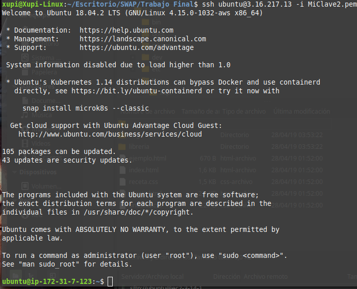

## Instalar servidor Web
Ahora pondré los pasos básicos para instalar Apache, MySQL server y PHP en Ubuntu:

```
sudo apt-get update
sudo apt-get install apache2 -y
sudo apt-get install mysql-server -y
```
Para configurar _MySQL_ haremos `sudo mysql_secure_installation` y dejaremos la configuración por defecto, no tenemos por qué rellenar nada excepto la contraseña.
```
sudo apt-get install php libapache2-mod-php -y
```
Ya tenemos el servidor web operativo, poniendo en cualquier navegador la dirección ip (_Public DNS_ o _Public IP_) veremos la página por defecto de Apache.

## Crear Balanceador de Carga
Para hacer un balanceador que sirva para dividir la carga entre los dos servidores, previamente deberemos crear un __Target__:
En la barra de la izquierda, buscamos la sección _Load Balancing_ y vamos a _Target Groups_ y pulsamos `Create target group` para crear uno. Lo llamamos como queramos y pulsamos `Create`
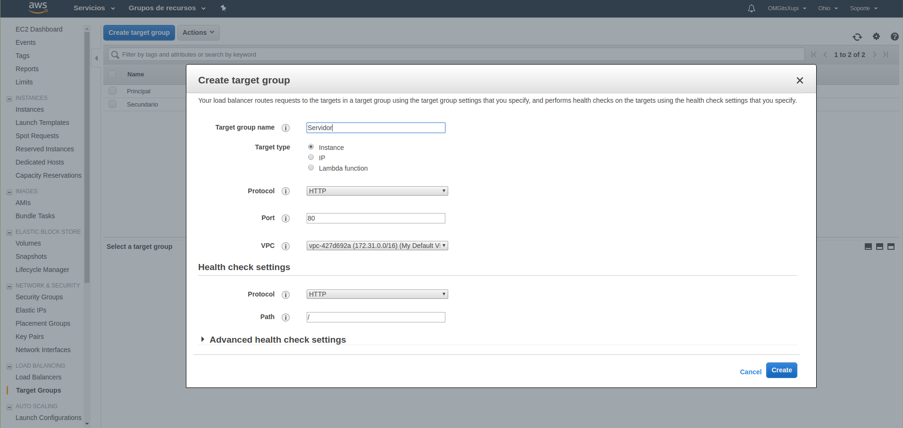

En el menú de _Target Groups_, seleccionaremos el que acabamos de crear y, abajo, en la pestaña de _Targets_ hacemos click en `Edit`.
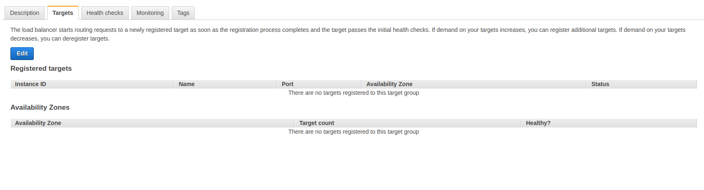

Seleccionamos ambas instancias, las incluimos y pulsamos `Save`, quedaría así:
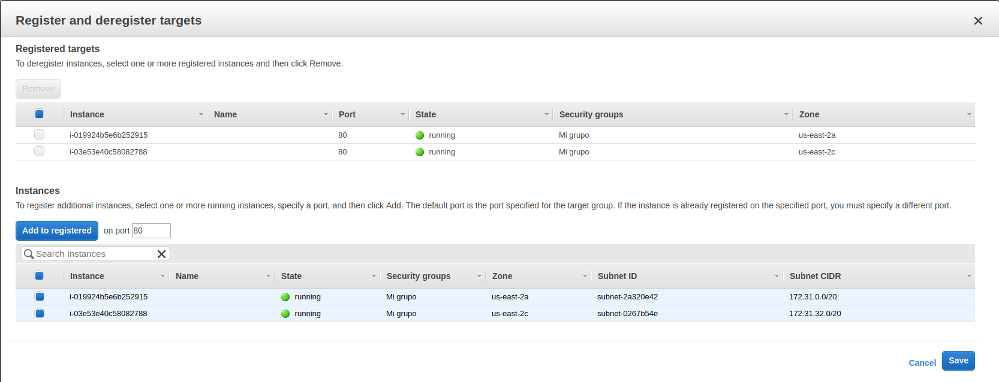

Ahora, vamos a _Load Balancers_ en el menú lateral y le damos a crear uno. En las opciones que aparecen, nosotros seleccionaremos HTTP/HTTPS y pulsamos `Create`:
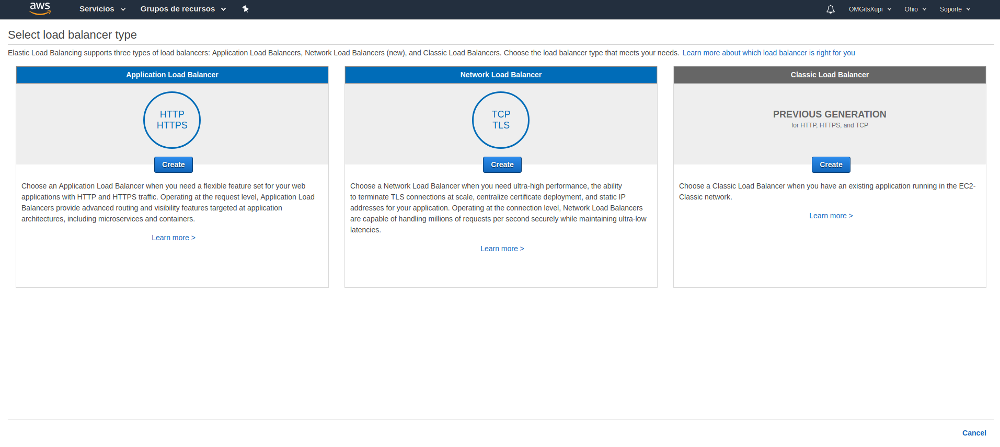

Le ponemos el nombre que queramos, podemos añadir un Listener para HTTPS si queremos, pero para esto necesitaremos un certificado. Lo que sí es lo correcto que hagamos es seleccionar las tres _Availability Zones_ que nos aparecen para que se detecten las instancias seguro.
Iremos a la pestaña _Configure Security Groups_ y seleccionaremos el grupo que creamos previamente.
En _Configure Routing_ seleccionaremos el _Target Group_ que acabamos de crear.
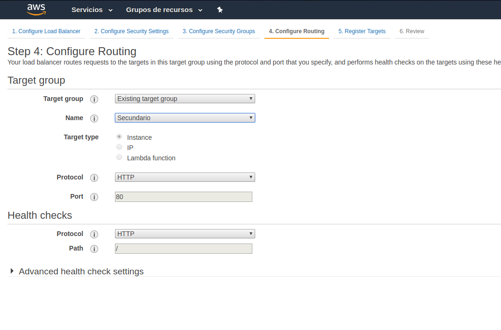

Vamos al último paso y pulsamos `Create`
Ya está creado el balanceador. Para conectarnos a él, tendremos que copiar el _DNS name_ que aparece en su menú, y copiarlo en el navegador:
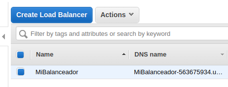

Ahora, con un algoritmo de Round Robin, va alternando entre las dos instancias cada vez que hay una petición. Podemos comprobarlo cambiando el archivo de la web de Apache con `sudo nano /var/www/html/index.html` y veremos que va alternando.
